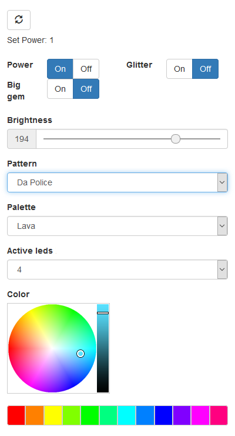

FastLED + ESP8266 Web Server
=========

Control an addressable LED strip with an ESP8266 via a web browser or infrared remote control. In regards to the original code, I've added some GUI buttons and a new pattern and removed the IR code, so I can use the ESP8266 in a LARP game. 

Hardware
--------

An ESP8266 development board, such as the NodeMCU

Addressable LED strip, such as the [Adafruit NeoPixel Ring]:

Features
--------
* Turn the NeoPixel Ring on and off
* Adjust the brightness
* Change the display pattern
* Adjust the color
* Select the number of lit leds 

Web App
--------

Patterns are requested by the app from the ESP8266, so as new patterns are added, they're automatically listed in the app.

The web app is stored in SPIFFS (on-board flash memory).

The web app is a single page app that uses [jQuery](https://jquery.com) and [Bootstrap](http://getbootstrap.com).  It has buttons for On/Off, a slider for brightness, a pattern selector, and a color picker (using [jQuery MiniColors](http://labs.abeautifulsite.net/jquery-minicolors)).  Event handlers for the controls are wired up, so you don't have to click a 'Send' button after making changes.  The brightness slider and the color picker use a delayed event handler, to prevent from flooding the ESP8266 web server with too many requests too quickly.

The only drawback to SPIFFS that I've found so far is uploading the files can be extremely slow, requiring several minutes, sometimes regardless of how large the files are.  It can be so slow that I've been just developing the web app and debugging locally on my desktop (with a hard-coded IP for the ESP8266), before uploading to SPIFFS and testing on the ESP8266.

Installing
-----------
The app is installed via the Arduino IDE which can be [downloaded here](https://www.arduino.cc/en/main/software). The ESP8266 boards will need to be added to the Arduino IDE which is achieved as follows. Click File > Preferences and copy and paste the URL "http://arduino.esp8266.com/stable/package_esp8266com_index.json" into the Additional Boards Manager URLs field. Click OK. Click Tools > Boards: ... > Boards Manager. Find and click on ESP8266 (using the Search function may expedite this). Click on Install. After installation, click on Close and then select your ESP8266 board from the Tools > Board: ... menu.

The app depends on the following libraries. They must either be downloaded from GitHub and placed in the Arduino 'libraries' folder, or installed as [described here](https://www.arduino.cc/en/Guide/Libraries) by using the Arduino library manager.

* [FastLED](https://github.com/FastLED/FastLED)
* [Arduino WebSockets](https://github.com/Links2004/arduinoWebSockets)

Download the app code from GitHub using the green Clone or Download button from [the GitHub project main page](https://github.com/jasoncoon/esp8266-fastled-webserver) and click Download ZIP. Decompress the ZIP file in your Arduino sketch folder.

The web app needs to be uploaded to the ESP8266's SPIFFS.  You can do this within the Arduino IDE after installing the [Arduino ESP8266FS tool](https://github.com/esp8266/Arduino/blob/master/doc/filesystem.md#uploading-files-to-file-system).

With ESP8266FS installed upload the web app using `ESP8266 Sketch Data Upload` command in the Arduino Tools menu.

Then enter your wi-fi network SSID and password in the .ino file, and upload the sketch using the Upload button.

Compression
-----------

The web app files can be gzip compressed before uploading to SPIFFS by running the following command:

`gzip -r data/`

The ESP8266WebServer will automatically serve any .gz file.  The file index.htm.gz will get served as index.htm, with the content-encoding header set to gzip, so the browser knows to decompress it.  The ESP8266WebServer doesn't seem to like the Glyphicon fonts gzipped, though, so I decompress them with this command:

`gunzip -r data/fonts/`

REST Web services
-----------------

The firmware implements basic [RESTful web services](https://en.wikipedia.org/wiki/Representational_state_transfer) using the ESP8266WebServer library.  Current values are requested with HTTP GETs, and values are set with POSTs using query string parameters.  It can run in connected or standalone access point modes.